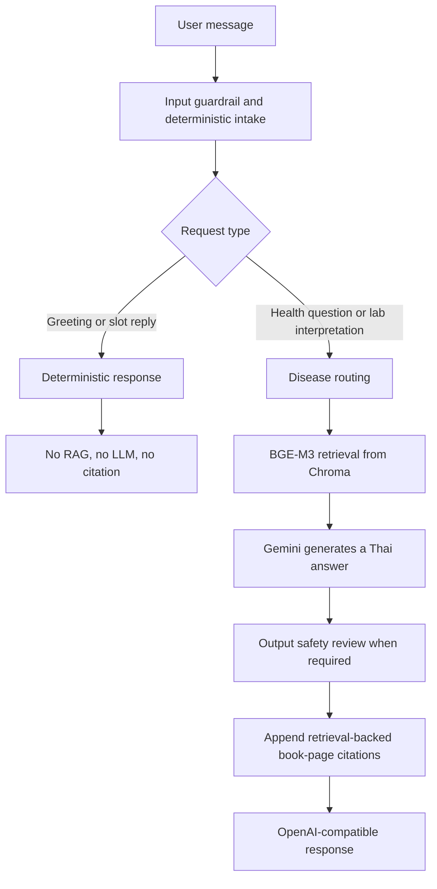

# Health Chatbot

An OpenAI-compatible Thai health-information chatbot for preliminary checkup-result interpretation. It uses LangGraph, citation-aware RAG, and deterministic safety/intake flows to help users ask about diabetes, hypertension, dyslipidemia, and chronic kidney disease.

> **Important:** This project provides preliminary health information only. It is not a doctor, does not diagnose disease, prescribe medication, or replace professional medical care.

## Features

- Thai responses from English LLM instructions.
- Deterministic extraction of common laboratory values, age, sex, and fasting status.
- Citation-aware retrieval from Thai clinical textbooks, with **book page** references.
- BGE-M3 embeddings with Chroma persistence.
- Disease routing to reduce cross-guideline citations:
  - Lipids: LDL, HDL, triglycerides, statins, lipid profiles
  - Diabetes: FBS, glucose, HbA1c, metformin
  - Kidney disease: eGFR, creatinine, ACR, CKD, proteinuria
  - Hypertension: blood pressure, antihypertensive terms, sodium
- Multi-disease retrieval: retrieves two candidates per routed source, embeds the query once, and round-robins evidence so one disease cannot consume the entire context.
- Deterministic intake and slot replies without RAG, LLM calls, or citations.
- Input relevance checks, safety-sensitive output review, and follow-up slot handling.
- Startup warm-up for LangGraph, Chroma, and BGE-M3 to avoid first-request retrieval latency.
- Request timing logs for resource loading, retrieval, LLM generation, graph invocation, and total latency.
- Optional Langfuse traces grouped by monitoring session, with per-generation token usage.
- Built-in multi-turn patient simulator and LLM judge.

## Request Flow



Examples of deterministic requests are greetings, requests for the supported scope, and answers to a pending age, sex, or fasting question. These requests must never show textbook citations.

## Citation-Aware RAG

Source markdown lives in `data/processed_markdown/`. Each retained OCR block has source, textbook-page, and PDF-page metadata. The vector database stores page-local chunks with metadata such as:

```text
source_id, source_title, disease, book_page, pdf_page, source_file, chunk_index
```

The user-facing response groups multiple pages from the same book on one line:

```text
อ้างอิงจากตำรา:
- แนวทางเวชปฏิบัติการบำบัดภาวะไขมันผิดปกติในเลือด..., หน้า 16, 23, 29
```

For a multi-disease question such as `FBS 126 and LDL 178`, the retriever queries both the diabetes and dyslipidemia sources. It uses one query embedding and obtains two candidates per source before interleaving the context.

## Project Layout

```text
backend/
  main.py                         FastAPI application and startup warm-up
  routes/chat.py                  OpenAI-compatible chat endpoint
  routes/eval.py                  Evaluation simulator routes

services/
  health_chat_service.py          Conversation slots, fast paths, timing wrapper
  eval_service.py                 Patient simulation and LLM judging

agent/
  graph.py                        LangGraph assembly
  intake.py                       Rule-based extraction and intent classification
  slot_filling_graph.py           Deterministic intake routing
  analyst.py                      Retrieval query/routing and answer generation
  rag_utils.py                    BGE-M3 + Chroma retrieval and citations
  guardrails.py                   Input and output safety logic
  prompts.py                      English LLM instructions with Thai-output rule
  models.py                       Vertex AI model configuration

data/
  processed_markdown/             Page-aware, OCR-cleaned textbook markdown
  build_citation_processed_markdown.py
  build_citation_vector_db.py
  evals/retrieval_questions_100.json

notebooks/
  retrieval_evaluation.ipynb      Routing, leakage, and latency benchmark
```

## Setup

Create a Python environment and install dependencies:

```bash
python3 -m venv .venv
source .venv/bin/activate
pip install -r requirements.txt
```

Configure Vertex AI credentials in `.env` or the process environment:

```bash
GOOGLE_APPLICATION_CREDENTIALS=/absolute/path/to/service-account.json
GOOGLE_CLOUD_PROJECT=your-gcp-project-id
```

For a deployed environment, `GCP_CREDS_JSON` can contain the service-account JSON instead.

Start the API:

```bash
uvicorn backend.main:app --host 0.0.0.0 --port 8000 --reload
```

Wait for this startup message before measuring warm-request latency:

```text
[Startup Warmup] Health agent and RAG are ready.
```

## Configuration

| Variable | Default | Purpose |
| --- | --- | --- |
| `GOOGLE_APPLICATION_CREDENTIALS` | unset | Path to a Google credential file. |
| `GOOGLE_CLOUD_PROJECT` | unset | Google Cloud project ID. |
| `GCP_CREDS_JSON` | unset | Service-account JSON for deployed environments. |
| `HEALTH_CHAT_MODEL` | `gemini-2.5-flash-lite` | Model used for health answers and safety review. Set to `gemini-2.5-flash` to use the larger model. |
| `WARM_RAG_ON_STARTUP` | `true` | Set to `false` to disable graph/RAG startup warm-up. |
| `LANGFUSE_ENABLED` | `false` | Set to `true` to emit privacy-minimized chat traces. |
| `LANGFUSE_CAPTURE_CONTENT` | `false` | Set to `true` to include masked, truncated user messages, assistant answers, and per-generation prompt/output messages in Langfuse. Common direct identifiers (email, phone, Thai national ID, URL, IP address, and dates) are redacted. Review this setting with your privacy policy before enabling it. |
| `LANGFUSE_PUBLIC_KEY` | unset | Langfuse project public key. |
| `LANGFUSE_SECRET_KEY` | unset | Langfuse project secret key. |
| `LANGFUSE_BASE_URL` | Langfuse EU Cloud | Langfuse Cloud region or self-hosted base URL. |
| `LANGFUSE_TRACING_ENVIRONMENT` | `default` | Environment attached to Langfuse observations, such as `production` or `staging`. |

## API

### `GET /v1/models`

Returns the supported OpenAI-compatible model identifiers.

### `POST /v1/chat/completions`

Example request:

```bash
curl -s http://127.0.0.1:8000/v1/chat/completions \
  -H 'Content-Type: application/json' \
  -d '{
    "model": "health-agent",
    "messages": [
      {"role": "user", "content": "LDL 178 สูงไหม ต้องทำอย่างไร"}
    ],
    "conversation_id": "demo-001",
    "session_id": "usage-session-001"
  }'
```

`conversation_id` owns conversation history, summaries, and slot memory. Reusing it
preserves chatbot context. `session_id` is an independent monitoring boundary used
for Langfuse grouping and runtime token totals. A single conversation can therefore
continue across multiple monitoring sessions without losing history. Legacy clients
that omit `session_id` fall back to `conversation_id`.

Every response reports provider token counts for the current request in the
top-level `usage` object. It also includes cumulative counts for the current
conversation under `choices[0].message.metadata.token_usage`:

```json
{
  "usage": {
    "prompt_tokens": 367,
    "completion_tokens": 6,
    "total_tokens": 373
  },
  "choices": [
    {
      "message": {
        "metadata": {
          "token_usage": {
            "request": {"prompt_tokens": 367, "completion_tokens": 6, "total_tokens": 373},
            "session": {"prompt_tokens": 1240, "completion_tokens": 91, "total_tokens": 1331}
          }
        }
      }
    }
  ]
}
```

The backend also prints one `[Token Usage]` log entry per request. Runtime session
totals prefer `session_id`, then fall back to `conversation_id` or `chat_id`. These
totals are held in process memory, so they reset whenever the backend restarts or is
redeployed. Langfuse is the durable source for cross-worker and cross-deployment
usage analytics.

When Langfuse is enabled, one `health-chat-turn` trace is created per request and
LLM calls are recorded as child generations. By default, observations include IDs,
token usage, execution metadata, and character counts only; raw health prompts and
responses are not sent to Langfuse by this instrumentation. Set
`LANGFUSE_CAPTURE_CONTENT=true` to add bounded, masked, role-labelled messages to
the root trace and each LLM generation. This is still not a guarantee that every
personal identifier is removed, so enable it only when your privacy and
data-retention policies permit it.

## Build the Citation Database

Place the clean OCR markdown and corresponding PDFs in `raw_data/`, then run:

```bash
python data/build_citation_processed_markdown.py
python data/build_citation_vector_db.py
```

The first command aligns clean OCR blocks to PDF pages and writes `data/processed_markdown/`. The second command rebuilds the single active Chroma database at `data/chroma_db_health` using `BAAI/bge-m3`.

## Retrieval Evaluation

The repository includes 100 Thai questions, balanced across dyslipidemia, diabetes, kidney disease, and hypertension:

```text
data/evals/retrieval_questions_100.json
```

Open and run:

```text
notebooks/retrieval_evaluation.ipynb
```

It reports routing accuracy, source leakage, empty-citation rate, and p50/p95 retrieval latency. It also exports detailed review data to:

```text
data/evals/retrieval_results.csv
```

Set `WARMUP = False` in the notebook to include cold-start behavior. Keep it `True` to benchmark normal warmed-up retrieval.

## Evaluation Simulator

Open the local simulator at:

```text
http://127.0.0.1:8000/eval/simulator
```

It runs a simulated patient through the chatbot, records per-turn latency, and asks an LLM judge to score safety, grounding, context use, clarity, and task completion. Simulation cases and judge criteria are stored in `eval/`.

## Safety and Operational Notes

- Do not treat an LLM response as diagnosis, dosage, or an instruction to start, stop, or change medication.
- Urgent or red-flag flows should provide immediate escalation guidance before collecting optional details.
- Citations establish provenance, but a clinician should validate that each important claim is supported by the cited page before production use.
- Avoid logging identifiable health data in production. Define retention, deletion, and consent practices before handling real users.
- Run the retrieval and safety evaluation sets after changing prompts, routing, source documents, or models.

## Quick Checks

```bash
python -m py_compile agent/*.py backend/*.py backend/routes/*.py services/*.py
python -m json.tool data/evals/retrieval_questions_100.json > /dev/null
git diff --check
```
